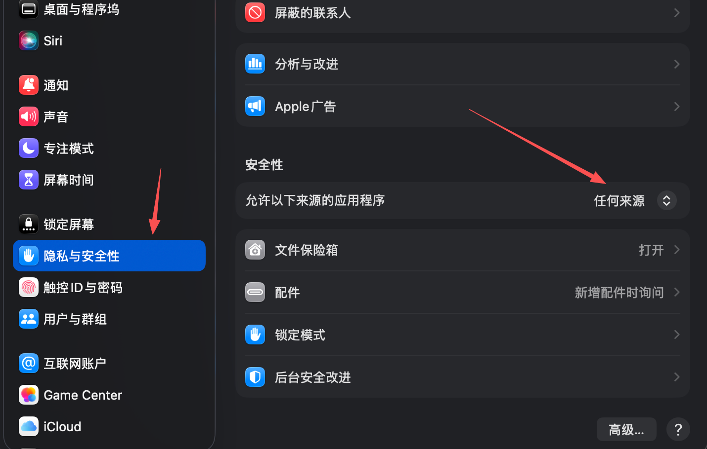

# Video2MP3

Video2MP3 是一个原生 macOS 小工具，用于从常见视频文件中提取音频并保存为 MP3。

## 功能

- 拖拽导入视频或文件夹。
- 通过按钮选择视频文件或文件夹。
- 文件夹导入会递归扫描子文件夹。
- 支持 `.mp4`、`.mov`、`.m4v`、`.avi`、`.mkv`、`.webm`、`.flv`、`.wmv`、`.mpeg`、`.mpg`、`.3gp`。
- 批量串行转换，避免同时运行多个 ffmpeg 占满 CPU。
- 用户指定输出文件夹。
- 递归导入时保留原目录结构。
- 输出 MP3，不覆盖已有文件，重名时自动追加序号。
- 默认使用 `libmp3lame`、`192k`，并将 title 元数据写为源视频文件名。
- 提供包含 `V23` 标识的 macOS app 图标。

## 下载

Video2MP3 是一个有可视化界面的 macOS app。发布包内置 ffmpeg，普通用户不需要写代码，也不需要手动安装 ffmpeg。

在 GitHub Releases 中优先下载与你的 Mac 芯片匹配的 DMG：

- `Video2MP3-macOS-arm64.dmg`：Apple Silicon，M 系列芯片。
- `Video2MP3-macOS-x86_64.dmg`：Intel Mac。

安装方式：

1. 打开下载的 DMG。
2. 将 `Video2MP3.app` 拖到 `Applications`。
3. 从“应用程序”文件夹打开 Video2MP3。

zip 文件也会作为备用下载方式保留。解压后同样可以得到 `Video2MP3.app`。

当前版本使用 ad-hoc signing，尚未 notarize。如果首次打开时 macOS 阻止启动，可以：

1. 打开“系统设置 > 隐私与安全性”，在安全提示处允许打开。
2. 或在 Finder 中右键 `Video2MP3.app`，选择“打开”。

### macOS 提示“Apple 无法验证”时怎么办

当前发布包暂未进行 Apple Developer ID 签名和 notarization 公证。第一次在某台 Mac 上打开时，系统可能提示：

```text
未打开 “Video2MP3”
Apple 无法验证 “Video2MP3” 是否包含可能危害 Mac 安全或泄漏隐私的恶意软件。
```

这是 macOS Gatekeeper 的安全提示，不代表转换功能损坏。只想在单台电脑上使用时，可以按下面任一方式手动允许一次。

推荐方式：

1. 将 `Video2MP3.app` 拖到“应用程序”。
2. 在 Finder 中打开“应用程序”。
3. 右键点击 `Video2MP3.app`，选择“打开”。
4. 系统再次弹窗时，点击“打开”。

如果右键打开仍然被拦截：

1. 打开“系统设置 > 隐私与安全性”。
2. 向下滚动到“安全性”区域。
3. 找到关于 `Video2MP3` 被阻止的提示。
4. 点击“仍要打开”，然后输入密码或使用 Touch ID 确认。

也可以参考下面的位置，在“隐私与安全性”的“安全性”区域允许对应来源的应用：



如果系统里没有“任何来源”选项，可以在终端执行下面命令让它显示出来：

```bash
sudo spctl --global-disable
```

旧版 macOS 如果不支持上面的参数，可以尝试：

```bash
sudo spctl --master-disable
```

执行后重新打开“系统设置 > 隐私与安全性”，在“允许以下来源的应用程序”中选择“任何来源”。完成测试后，建议改回更安全的选项，例如“App Store 与已知开发者”。如果只是为了打开 Video2MP3，一般优先使用“右键 > 打开”或“仍要打开”，不建议长期保持“任何来源”。

如果已经把 app 拖到“应用程序”，也可以只移除这个 app 的下载隔离标记：

```bash
xattr -dr com.apple.quarantine /Applications/Video2MP3.app
```

这个操作只影响本机的这个 app。换另一台 Mac 下载时，仍然需要重新允许一次。

## 使用

1. 打开 app。
2. 拖入视频或文件夹，也可以点击“选择视频”或“选择文件夹”。
3. 点击“输出到”选择 MP3 保存目录。
4. 点击“开始转换”。
5. 转换完成后点击“在 Finder 中显示”查看输出文件。

文件夹导入会递归扫描子文件夹，并在输出目录中保留原目录结构。

## 开发

当前项目使用 Swift Package Manager 组织代码：

```bash
swift build
swift run Video2MP3
```

开发环境可以通过以下任一方式提供 ffmpeg：

1. 将 macOS 版 ffmpeg 放到 `Resources/ffmpeg/ffmpeg`。
2. 设置环境变量：

```bash
export VIDEO2MP3_FFMPEG_PATH=/path/to/ffmpeg
```

3. 使用 Homebrew 安装：

```bash
brew install ffmpeg
```

测试在完整 Xcode 或 GitHub Actions macOS runner 上运行：

```bash
swift test
```

某些精简 Command Line Tools 环境可能缺少 `XCTest` 模块，此时可先用 `swift build` 验证编译。

## 打包

打包当前机器架构的 app 和 zip：

```bash
scripts/package_app.sh
```

指定架构：

```bash
scripts/package_app.sh --arch arm64
scripts/package_app.sh --arch x86_64
```

生成 DMG：

```bash
scripts/package_dmg.sh --arch arm64
scripts/package_dmg.sh --arch x86_64
```

生成 universal 包需要完整 Xcode：

```bash
sudo xcode-select -s /Applications/Xcode.app/Contents/Developer
scripts/package_app.sh --universal
```

产物会生成到 `dist/`：

- `dist/Video2MP3.app`
- `dist/Video2MP3-macOS-arm64.zip`
- `dist/Video2MP3-macOS-arm64.dmg`
- `dist/Video2MP3-macOS-x86_64.zip`
- `dist/Video2MP3-macOS-x86_64.dmg`
- `dist/Video2MP3-macOS-universal.zip`

具体文件取决于打包参数。

## 发布

仓库包含 GitHub Actions workflow。推送 `v*` tag 时会：

- 在 `macos-26` 构建 arm64 包。
- 在 `macos-26-intel` 构建 x86_64 包。
- 安装并内置 ffmpeg。
- 运行构建和测试。
- 对 app 做 ad-hoc signing。
- 上传 zip 和 DMG 到 GitHub Release。

示例：

```bash
git tag v0.1.0
git push origin v0.1.0
```

## 当前已知限制

- 只输出 MP3。
- MP3 码率固定为 `192k`。
- 暂不提供 App Store 版本。
- 暂未 notarize，首次打开可能需要用户手动允许。
- ffmpeg 授权取决于发布包中内置 ffmpeg 的构建配置，维护者发布前必须核对对应授权义务。

## License

MIT。内置 ffmpeg 的授权信息见 `THIRD_PARTY_NOTICES.md`。
